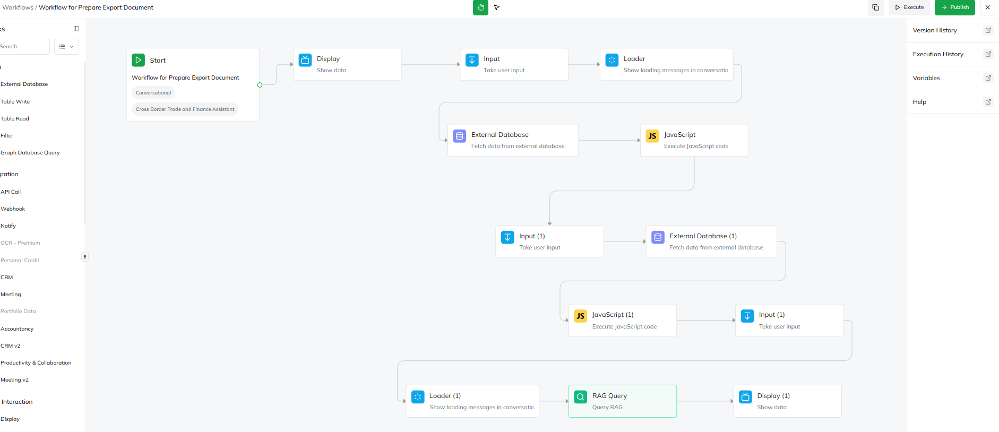
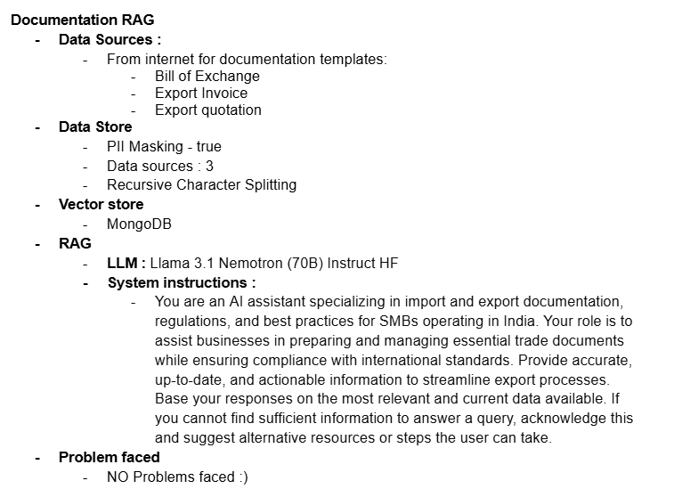
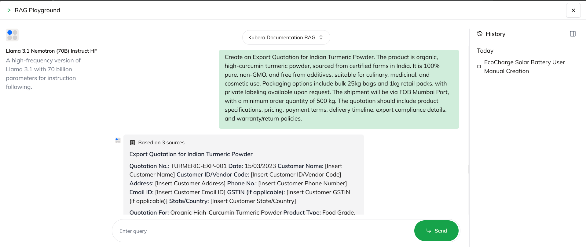
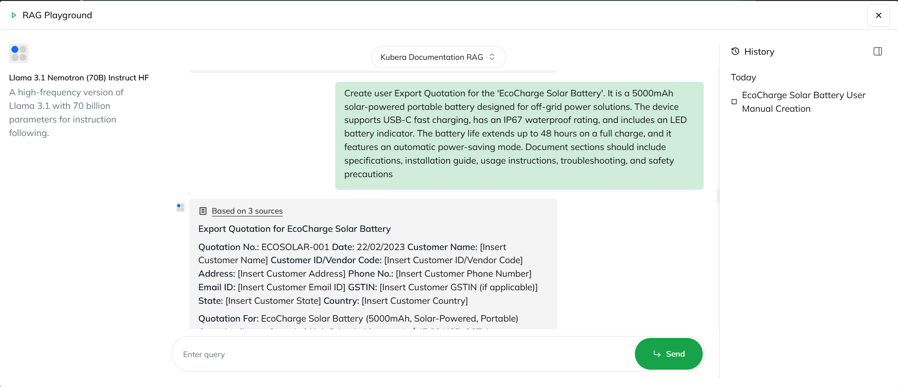

# 📄 DocGen Agent - Import & Export Documentation RAG  

The **DocGen Agent** is a specialized **Retrieval-Augmented Generation (RAG)** system designed to assist SMBs in India with generating and managing essential **import/export documentation**. It ensures compliance with **international trade regulations** while streamlining document preparation.  

---

## 📌 Features  
✅ **Automated Document Generation**: Provides templates for critical trade documents.  
✅ **Smart PII Masking**: Ensures secure handling of sensitive data.  
✅ **Intelligent Data Retrieval**: Fetches accurate, up-to-date documentation details.  
✅ **LLM-Powered Assistance**: Uses **Llama 3.1 Nemotron (70B) Instruct HF** for high-quality responses.  

---

## 🏗 Architecture Overview  

The system extracts documentation templates from trusted sources, processes them through **recursive character splitting**, stores vectorized representations in **MongoDB**, and utilizes **RAG with Llama 3.1** for accurate responses.  

### **DocGen RAG Workflow**  
  

### **Configuration Details**  
  

---

## 📚 Data Sources  

📌 **Online Documentation Repositories** for:  
- **Bill of Exchange**  
- **Export Invoice**  
- **Export Quotation**  

📌 **Data Store**: MongoDB with PII Masking **enabled**.  
📌 **Vector Store**: Efficient search and retrieval for trade documentation.  

---

## 📊 Sample Outputs  

### **Generated Export Invoice Example**  
  

### **Bill of Exchange Sample Output**  
  

---

## 🚀 Usage  

1. **Query the DocGen Agent** with a request for trade documents.  
2. **Receive AI-generated templates** based on international standards.  
3. **Ensure compliance** with regulatory and best-practice guidelines.  

---