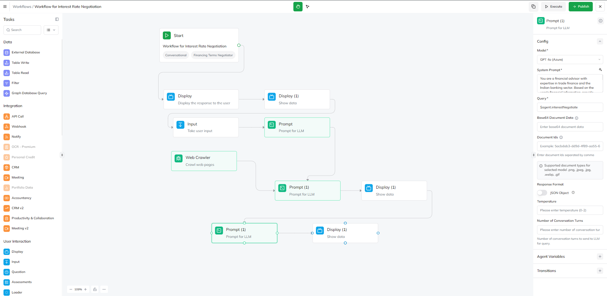
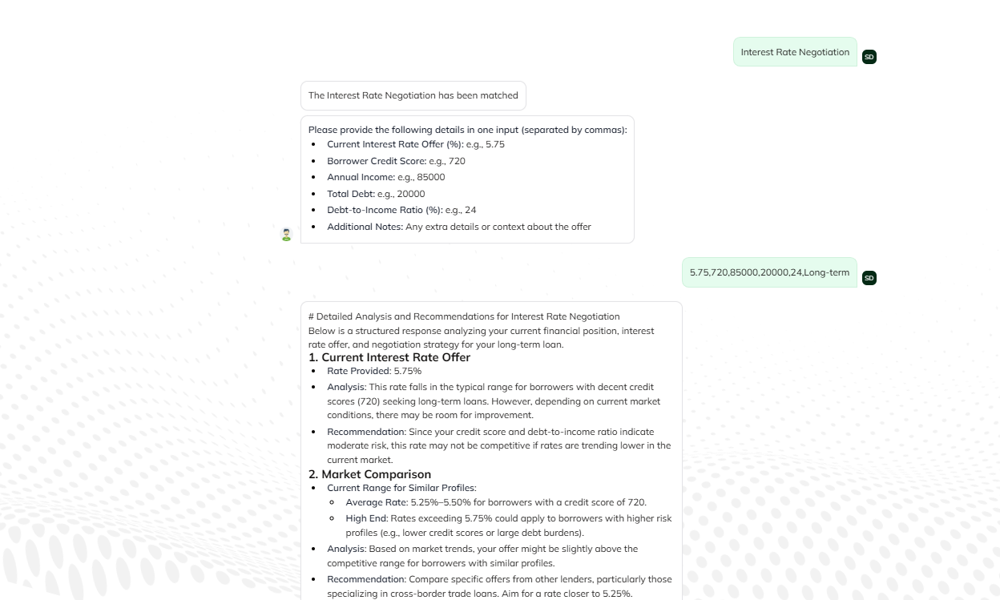
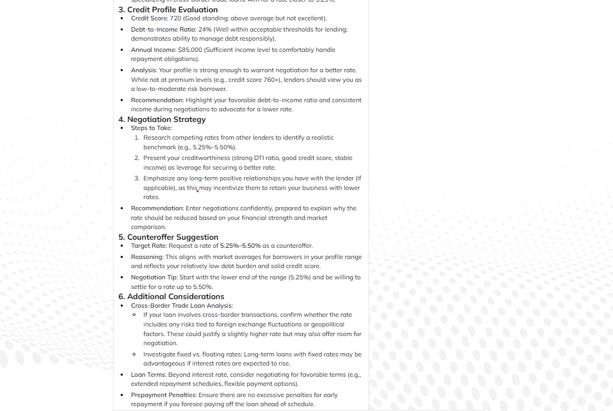
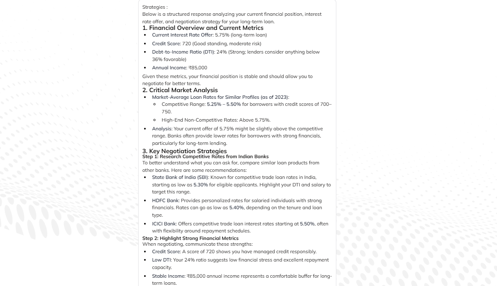
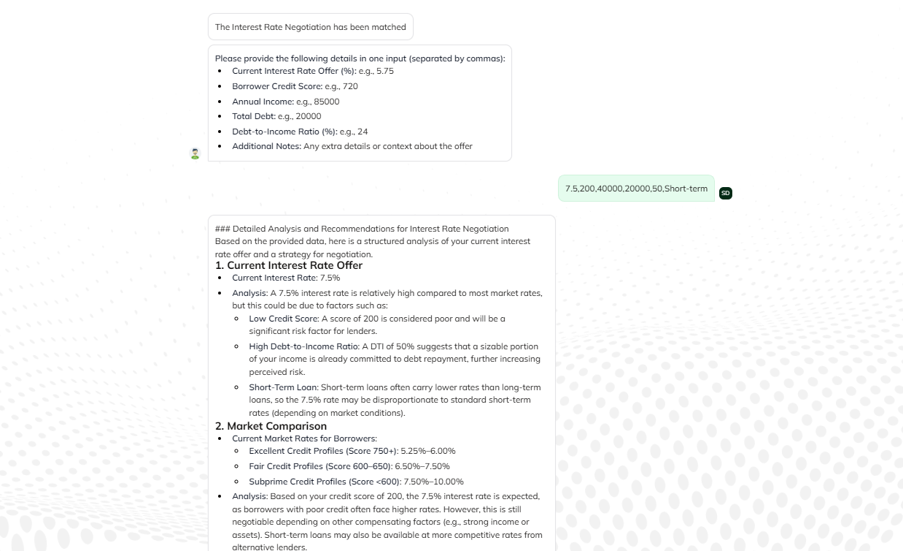
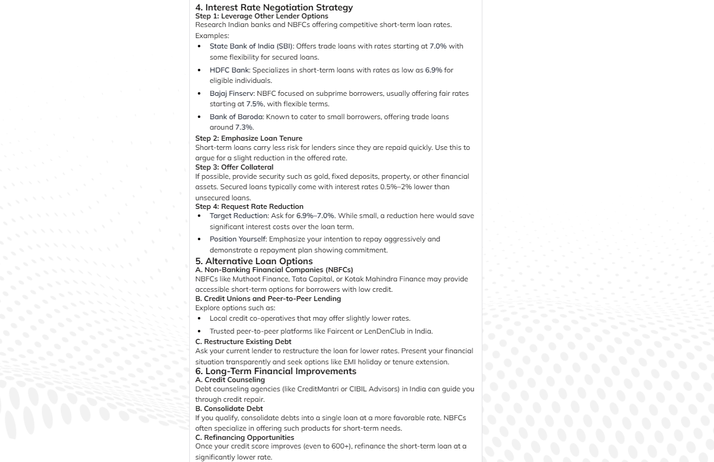

# Interest Rate Negotiator Agent

The Interest Rate Negotiator Agent is a component of the **Syrus2025 Financial Advisory Suite** under **Kubera**. It assists users in analyzing and negotiating interest rates for various financial products, leveraging advanced algorithms and real-time market data to provide personalized recommendations.&#8203;:contentReference[oaicite:2]{index=2}

## 📌 Features

- **Personalized Interest Rate Analysis**: 
Evaluates individual financial profiles to offer tailored interest rate assessments, ensuring users receive insights specific to their financial situation.
- **Market Comparison**:Compares current market interest rates by using Web Crawler, enabling users to identify and pursue the most competitive options available.
- **Negotiation Strategies**:Provides actionable strategies for negotiating better interest rates based on users' financial profiles and prevailing market conditions.
- **Bank Recommendations**: Suggests financial institutions known for offering favorable interest rates tailored to the user's specific financial needs and qualifications.

## 🏗 Architecture Overview
The Interest Rate Negotiator Agent employs a modular architecture that integrates data collection, analysis, and user interaction components to deliver accurate and personalized recommendations.

### **Workflow**

### **Configuration Details**
In Prompt node we have used Model GPT 4o (Azure) and provided it system prompt to generate Analysis where input is user input and web crawler data
In the next prompt node we have generated Strategies on basis of analysis obtained earlier.

## 📊 Sample Outputs

### **Input User Data**

### **Output 1**

### **Strategies**

### **Example 2**

### **Output of Example 2**

## 🚀 Usage

1. **Initialize the Interest Rate Negotiator Agent** by running the setup script.
2. **Input your financial details** including current interest rate, credit score, annual income, and total debt.
3. **Receive a comprehensive analysis** with personalized recommendations and negotiation strategies.
4. **Implement the suggested strategies** to negotiate better interest rates with financial institutions.

## 📌 Future Enhancements
- **Support for Multi-Language Queries**: 
- **Advanced Risk Analysis**: 
