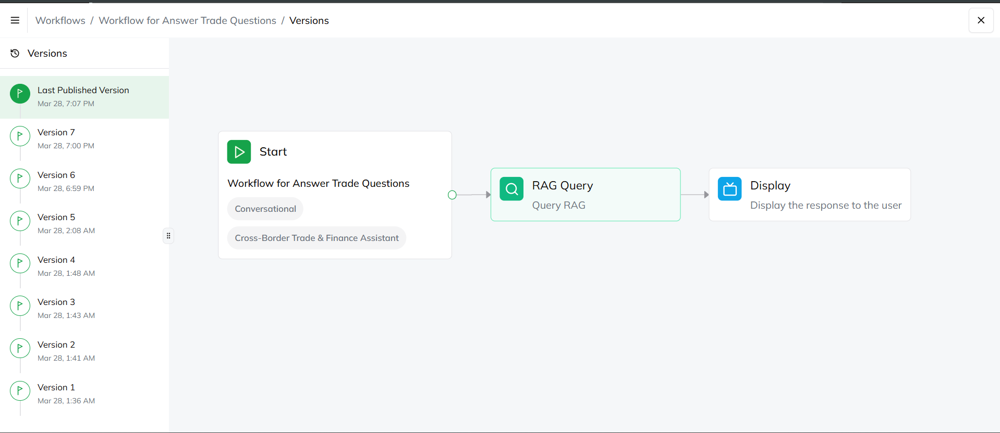
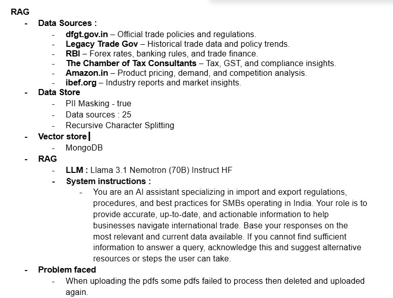
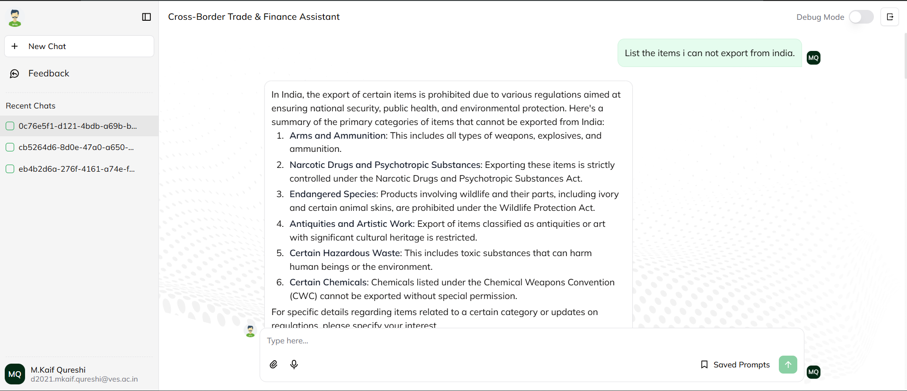
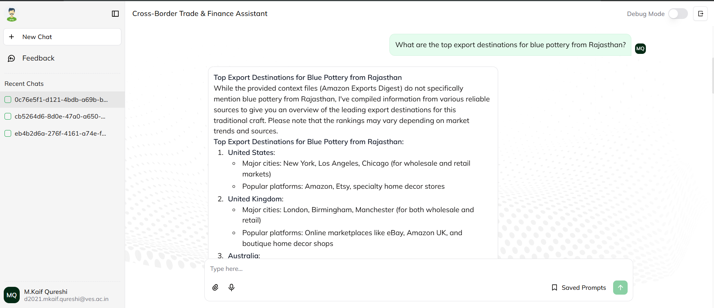
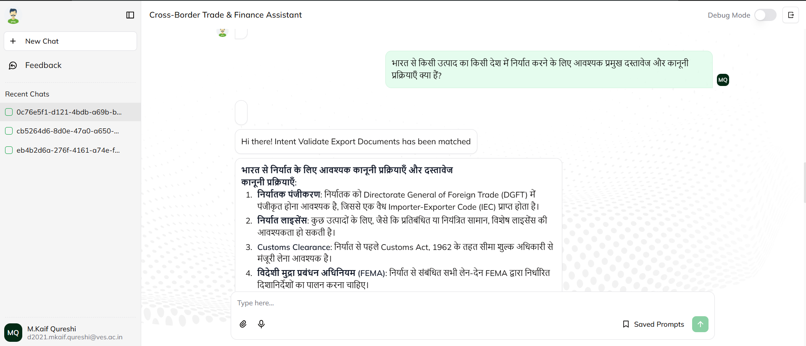

# QnA Agent - Cross-Border Trade & International Finance RAG

This QnA Agent is part of the **Syrus2025 Cross-Border Trade & International Finance** project under **Kubera**. It leverages Retrieval-Augmented Generation (RAG) to provide accurate, real-time answers related to international trade, taxation, compliance, and financial regulations.

## 📌 Features

- **RAG-based QnA**: Uses retrieval-augmented generation to fetch relevant trade and finance information.
- **Multi-Source Data Extraction**: Integrates insights from regulatory bodies, tax consultants, market trends, and e-commerce platforms.
- **Context-Aware Responses**: Ensures high relevance by processing structured and unstructured data sources.

## 🏗 Architecture Overview

The system follows a structured pipeline for extracting, processing, and generating responses:

### **RAG Workflow**

### **Configuration Details**

## 📊 Sample Outputs

### **Query Response Example 1**

### **Query Response Example 2**

### **Query Response Example 3**

## 🚀 Usage

1. **Initialize the QnA Agent** by running the setup script.
2. **Provide a query** related to import/export regulations, taxation, or trade finance.
3. **Get an AI-powered response** backed by real-time data and trusted sources.

## 📚 Data Sources

- **Government Trade Portals** (dfgt.gov.in, RBI, etc.)
- **Tax & Compliance Platforms**
- **Market Data from E-commerce Sites** (Amazon.in)
- **Industry Research Reports** (ibef.org)

## 📌 Future Enhancements

- Support for **multi-language queries** (including Hindi).
- Integration with **real-time trade policy updates**.
- Advanced **risk analysis for trade compliance**.
