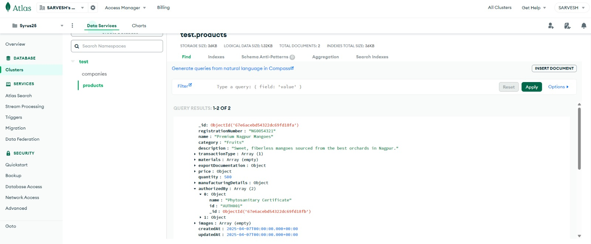

# 🪷 Kubera

## Mentoring Round 1: Key Discussion and Suggested Changes Details

### Questions asked :

### 1)How will you ensure the authenticity of exported items?

#### **Authorization of Exported Goods**

To ensure authenticity, exported items undergo rigorous **authorization and verification** by **renowned government agencies**.

### Regulatory Authorities Involved:

- 🇺🇸 **FDA** (Food and Drug Administration) - USA
- 🇮🇳 **FSSAI** (Food Safety and Standards Authority of India)
- 🇪🇺 **EU Customs & Regulatory Agencies**

### Verification & Tracking Mechanism:

- Each product is assigned a **unique identity tag**.
- An **ID-based authentication system** ensures legitimacy and traceability.
- **Government-issued compliance certificates** confirm authenticity and security.
- Advanced **tracking mechanisms** provide end-to-end visibility in international trade.

### 2) How does Kubera handle Personally Identifiable Information (PII) masking?

#### **PII Masking in AI Agent Workflows**

Kubera ensures PII protection using built-in **PII Masking Mechanisms** within the Uptiq AI framework:

- **Automated PII Recognition**: Detects and masks sensitive information before processing.
- **Compliance with Global Data Regulations**: Aligns with GDPR, CCPA, and other data privacy laws.
- **Customizable PII Masking Rules**: Allows for additional security layers based on business needs.
- **End-to-End Data Protection**: Prevents unauthorized exposure of personal details.

### References :

- [Uptiq Launches AI Workbench for Finance](https://www.uptiq.ai/blogs/uptiq-launches-ai-workbench-for-finance)
- [Utkarsh Ugale -UPTIQ ](https://www.youtube.com/@UtkarshUgale)
- [Live Discussion on AI Workbench](https://www.youtube.com/live/9jz7aSprGSQ)

## 🌟 Our Implemented Features

### 🌍 **RAG QAR Table**

| 🔹 **Feature**                  | 📝 **Description**                                 | 🔗 **GitHub Link**                                                                                                                        |
| ------------------------------- | -------------------------------------------------- | ----------------------------------------------------------------------------------------------------------------------------------------- |
| **RAG Document Generation**     | Generates trade-related insights dynamically.      | [ GitHub](https://github.com/CMPN-CODECELL/Syrus2025_Cross-BorderTrade-InternationalFinance_Hashcode/tree/main/Agents/QnA%20Agent)        |
| **Negotiation Assistance**      | Offers data-driven insights for loan negotiations. | [ GitHub](https://github.com/CMPN-CODECELL/Syrus2025_Cross-BorderTrade-InternationalFinance_Hashcode/tree/main/Agents/Negotiator%20Agent) |
| **Workflow for Tariff Changes** | Tracks and updates tariff modifications.           | [ GitHub](https://github.com/CMPN-CODECELL/Syrus2025_Cross-BorderTrade-InternationalFinance_Hashcode/tree/main/Agents/QnA%20Agent)        |

---
###  Documentation: 

- [Syrus Documentation](https://docs.google.com/document/d/1Z3bS_zWUPoLzFgCjPeYfFbB_HJ_jyIlaRdBijhP-LtA/edit?usp=sharing)  

## 👥 Team Members

| **Name**         |
| ---------------- |
| M. Kaif Quereshi |
| Sarvesh Dongare  |
| Yash Chhaproo    |
| Mohit Patil      |
